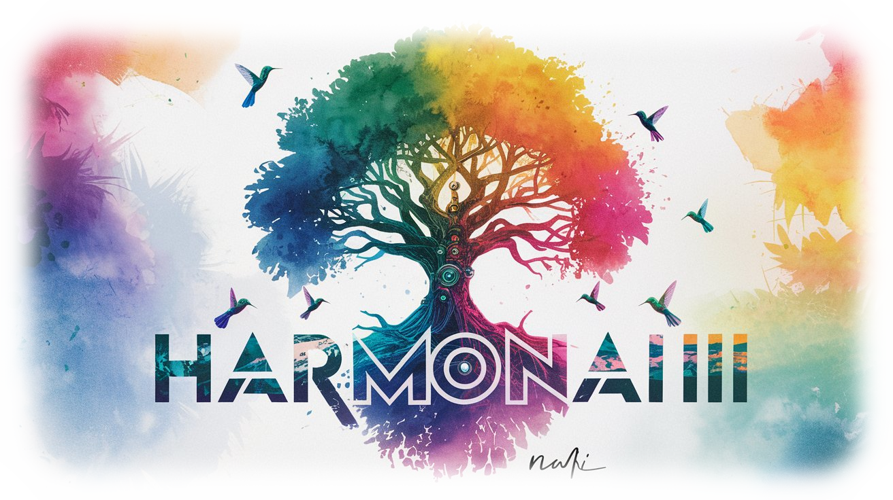

# 🌟 HarmonAI III 🌟

<p align="center">
  
</p>

<p align="center">
  <a href="https://github.com/Sunwood-ai-labs/HarmonAI_III">
    
  </a>
  <a href="https://github.com/Sunwood-ai-labs/HarmonAI_III/blob/main/LICENSE">
    
  </a>
  <a href="https://github.com/Sunwood-ai-labs/HarmonAI_III/stargazers">
    
  </a>
  <a href="https://github.com/Sunwood-ai-labs/HarmonAI_III/releases">
    
  </a>
  <a href="https://github.com/Sunwood-ai-labs/HarmonAI_III/graphs/commit-activity">
    
  </a>
  <a href="https://github.com/Sunwood-ai-labs/HarmonAI_III/pulls">
    
  </a>
  
  
</p>

<h2 align="center">
  ～ AI-Powered Automated Repository Management Template ～
</h2>

> [!IMPORTANT]
> HarmonAI IIIは、AIアシスタント([cline](https://github.com/clinebot/cline), [SourceSage](https://github.com/Sunwood-ai-labs/SourceSage))を活用して開発されたテンプレートリポジトリです。リリースノート、README、コミットメッセージの大部分は、最新のAI技術を用いて生成されています。

## 🚀 プロジェクト概要

HarmonAI IIIは、AIRAとIRISを統合した革新的な**AIリポジトリスターターキット**です。このリポジトリは、LLMを活用したAI開発プロジェクトの構造とワークフローを提供し、開発者の作業効率を劇的に向上させることを目的としています。バージョン: `v1.0.0`


## ✨ 主な機能

1. **統合AIツールセット**: AIRAとIRISの機能を1つのパッケージで提供
2. **即時利用可能**: テンプレートとして使用することで、高品質な初期構造を持つリポジトリを簡単に作成
3. **自動化された開発ワークフロー**: コミットメッセージ生成、リリースノート作成、イシュー管理の自動化
4. **多言語サポート**: READMEの自動翻訳機能により、国際的なプロジェクト展開をサポート
5. **柔軟なカスタマイズ**: プロジェクトのニーズに合わせて容易に調整可能
6. **LLMモデル更新**: `gemini/gemini-1.5-pro-exp-0827` から `gemini/gemini-1.5-flash-002` に更新。より高速で効率的な処理を実現。
7. **可視化ユーティリティ**: ファイル内の空白文字、タブ、改行などを可視化。
8. **パッチ適用ユーティリティ**: `git apply`コマンドを使用したパッチ適用機能。
9. **diffファイル処理ユーティリティ**: Markdown形式のdiff解析、HTML変換、コードブロック抽出機能。
10. **画像処理サービス**: ヘッダー画像の自動生成（フォント、タグ、背景、テキスト色、余白調整）。
11. **GitHub API操作サービス**: イシュー、コメント、ラベル、Pull Request、リリースの操作。
12. **Git操作サービス**: ブランチ作成、コミット、プッシュ、認証情報設定。
13. **S3/GitHub CDNへのファイルアップロードサービス(beta)**: AWS S3とGitHub CDNへのファイルアップロード自動化。
14. **S3バケットへの公開アクセス設定スクリプト(beta)**: S3バケットへの公開アクセス設定自動化。
15. **README更新スクリプト**: 最新のリリース情報を元にREADMEを自動更新。
16. **README翻訳スクリプト**: LLMを使用してREADME.mdを英語に翻訳。
17. **イシューへの変更提案生成スクリプト**: LLMを使用してイシューに対する具体的なコード変更提案をdiff形式で生成。
18. **イシューへのラベル自動追加スクリプト**: LLMと`labels.csv`を用いたイシューへのラベル自動追加。
19. **リリースノートヘッダー画像自動生成スクリプト**: タグ名とフォントを指定してヘッダー画像を生成。
20. **GitHubリリースノート自動生成スクリプト**: SourceSageとLLMを使用してGitHubリリースノートを自動生成。
21. **イシューに対する詳細コメント生成スクリプト**: LLMを使用してイシューの詳細なコメントを生成。
22. **変更提案の適用スクリプト**: GitHubイシューのコメントからdiffを抽出し、変更を適用。LLMを使用してdiff適用失敗時の対応とPull Request作成。


## 🛠️ 使用方法

### AIRAの使用例：
```bash
aira --mode sourcesage commit  --config=.aira\config.dev.commit.yml --ss-model-name="gpt-4o-mini" --llm-output="llm_output.md"
```

### IRISの使用例：

詳細な使用方法については、各コンポーネントのドキュメンテーションを参照してください。


## 📦 インストール手順

1. このリポジトリをテンプレートとして使用し、新しいリポジトリを作成します。
2. リポジトリをローカルにクローンします。
3. 必要な依存関係をインストールします：
   ```bash
   pip install -r requirements.txt
   ```
4. AIRAとIRISの設定ファイルをカスタマイズします。
5. GitHub Actionsの設定を確認し、必要に応じて環境変数を設定します。


## 🌿 環境構築

HarmonAI IIIの環境を構築するには、以下の手順に従ってください：

1. 仮想環境を作成します：
   ```bash
   python3 -m venv .venv
   ```
   これにより、`.venv`ディレクトリに仮想環境が作成されます。

2. 仮想環境をアクティベートします：
   ```bash
   source .venv/bin/activate  # Linux/macOS
   .venv\Scripts\activate  # Windows
   ```

3. 依存関係をインストールします：
   ```bash
   pip install -r requirements.txt
   ```

これらの手順により、HarmonAI IIIの開発環境が整います。


## 📚 主要コンポーネント

### 🤖 [AIRA (AI-Integrated Repository for Accelerated Development)](https://github.com/Sunwood-ai-labs/AIRA)
- リポジトリ作成の自動化
- コミットメッセージの自動生成

### 🌈 [IRIS (Intelligent Repository Issue Solver)](https://github.com/Sunwood-ai-labs/IRIS)
- イシューの自動分類
- 解決策の自動提案
- リリースノートの自動生成
- READMEの自動翻訳

## 🆕 最新情報

- v1.0.0リリース:  上記の通り、多数の新機能と改善が追加されました。


## 🤝 コントリビューション

HarmonAI IIIは、オープンソースプロジェクトとしてコミュニティからの貢献を歓迎しています。バグ報告、機能リクエスト、プルリクエストを通じて、このテンプレートリポジトリの改善にご協力ください。

## 📄 ライセンス

HarmonAI IIIは、[MITライセンス](LICENSE)の下で公開されています。

## 🙏 謝辞

HarmonAI IIIの開発にあたり、多くのオープンソースプロジェクトからインスピレーションを得ています。特に、AIRAとIRISの開発者の皆様に深く感謝申し上げます。Maki様にも感謝いたします。

---

HarmonAI IIIは、AI駆動の開発プロセスを実現する優れたスターターキットです。このテンプレートを基に、革新的なAIプロジェクトの開発を始めましょう！

